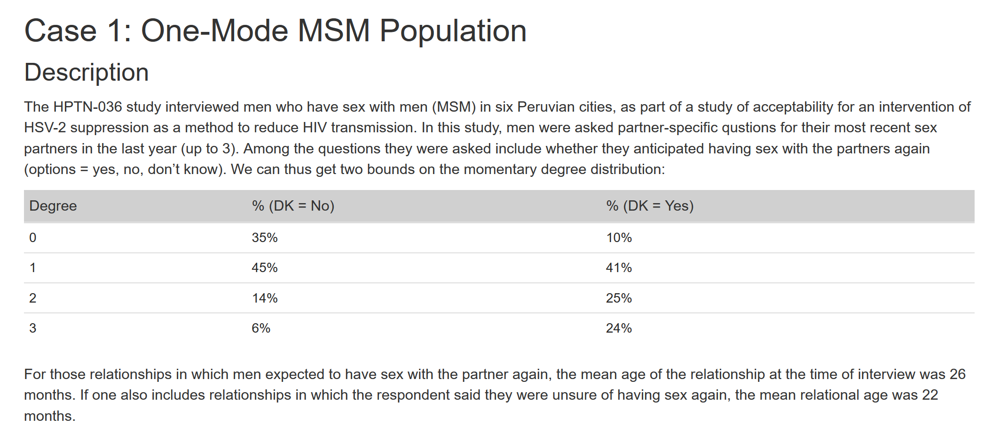

```{r global_options, include=FALSE}
knitr::opts_chunk$set(fig.width=12, fig.height=8, fig.path='Figs/',
                      eval = F, echo=T, warning=FALSE, message=FALSE)
```

# The Assignment
```{r echo=FALSE, out.width='100%', eval = T}
library(EpiModel)
library(knitr)

graphs<-readRDS("graphs.RDS")
```

```{r setup, include=FALSE}
# DK = no
my_net<-function(duration, stat, n, diss=dissolution_coefs(~offset(edges), duration)) {
nw <- network.initialize(n, directed = FALSE)
formation <- ~edges + degree(0:2) + degrange(from = 4)
netest(nw, formation, stat, diss)
}

my_dx<-function(net, param, nsim, nsteps) {
netdx(net, nsims = nsim, nsteps = nsteps,
      nwstats.formula = ~edges + degree(0:4))
}
my_sim<-function(dx, param, numInf, nsteps, nsim) {
init <- init.net(i.num = numInf)
control <- control.net(type = "SI", nsims = nsim, nsteps = nsteps)
netsim(dx, param, init, control)
}
```

```{r}
n<-100
dis_par<-param.net(inf.prob = 0.1, act.rate = 5)
nInf<-10
nStep<-100
```

# Model 1 DK=No
```{r}
net_par1 = c(45.5, 35, 45, 14, 0)
duration1 = 22
net1<-my_net(duration1, net_par1, n)
dx1<-my_dx(net1, net_par1, 5, nStep)
sim1<-my_sim(net1, dis_par, nInf, nStep, 5)
```

```{r,eval = T}
plot(graphs$dx1)

```

```{r, eval = T}
plot(graphs$sim1, sim.lines = TRUE)
```

<!-- #Model 1 DK=Yes -->
<!-- ```{r} -->
<!-- net_par2 = c(81.5, 10, 41, 25, 0) -->
<!-- duration2 = 26 -->
<!-- net2<-my_net(duration2, net_par2, n) -->
<!-- dx2<-my_dx(net2, net_par2, 5, nStep) -->
<!-- sim2<-my_sim(net2, dis_par, nInf, nStep, 5) -->
<!-- ``` -->

<!-- ```{r} -->
<!-- plot(dx2) -->
<!-- ``` -->

<!-- ```{r} -->
<!-- plot(sim2, sim.lines = TRUE) -->
<!-- ``` -->
# Random Network
```{r}
nw_ran <- network.initialize(n, directed = FALSE)
coef.diss <- dissolution_coefs(~offset(edges), duration)
formation <- ~edges + degrange(from = 4)
est_ran<-netest(nw_ran, formation, c(15,0), coef.diss)

dx_ran<-netdx(est_ran, nsims = 5, nsteps = nStep,
        nwstats.formula = ~edges + degree(0:4))
```

```{r, eval = T}
plot(graphs$dx_ran)
```


```{r}
sim_ran<-my_sim(est_ran, dis_par, nInf, nStep, 5)
```

```{r, eval = T}
plot(graphs$sim_ran, sim.lines = TRUE)
```

# SI Model
Birth and Death added of Model 1
```{r}
dis_par_bd1<-param.net(inf.prob = 0.1, act.rate = 2, a.rate = 0.01, ds.rate = 0.01, di.rate = 0.02)
sim_bd1<-my_sim(net1, dis_par_bd1, nInf, nStep, 5)
```

```{r, eval = T }
plot(graphs$sim1)
```

# Dissolution Coefficient of SI.

Overall death rate is .11, weighted average of infection and suspectibles.
```{r}

coef.diss <- dissolution_coefs(dissolution = ~offset(edges),
                               duration = 26, d.rate = .015)
dissol_net <-my_net(duration1, net_par1, n, coef.diss)
dissol_dx<-my_dx(dissol_net, net_par1, 5, nStep)
dissol_sim<-my_sim(dissol_net, dis_par_bd1, nInf, nStep, 5)
```

```{r, eval = T}

plot(graphs$dissol_sim)
```


<!-- ```{r, eval = T} -->


<!-- nw <- get_network(graphs$dissol_net$sim) -->

<!-- nw <- color_tea(nw, verbose = FALSE) -->

<!-- slice.par <- list(start = 1, end = 100, interval = 1, -->
<!--                   aggregate.dur = 1, rule = "any") -->
<!-- render.par <- list(tween.frames = 10, show.time = FALSE) -->
<!-- plot.par <- list(mar = c(0, 0, 0, 0)) -->

<!-- compute.animation(nw, slice.par = slice.par, verbose = TRUE) -->

<!-- render.d3movie( -->
<!--   nw, -->
<!--   render.par = render.par, -->
<!--   plot.par = plot.par, -->
<!--   vertex.col = "ndtvcol", -->
<!--   edge.col = "darkgrey", -->
<!--   vertex.border = "lightgrey", -->
<!--   displaylabels = FALSE, -->
<!--     output.mode='inline') -->

<!-- ``` -->


